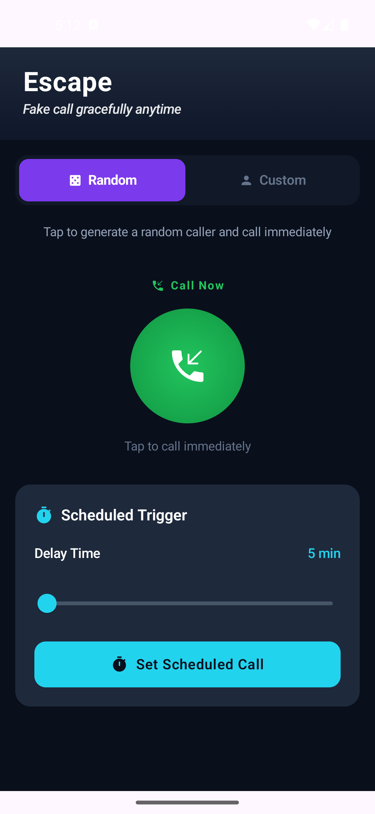
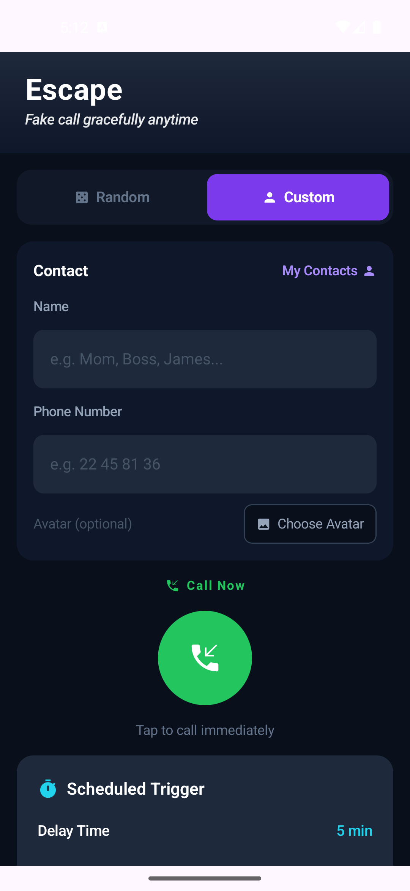
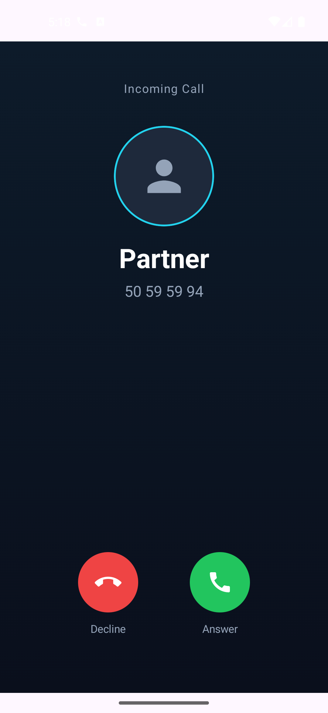
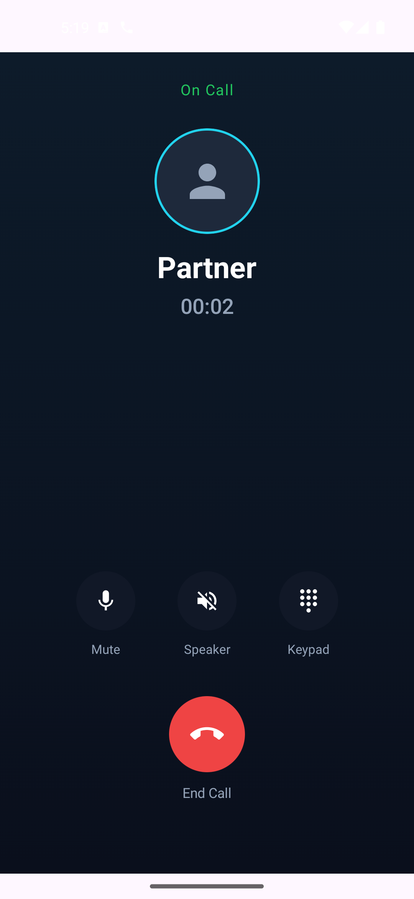
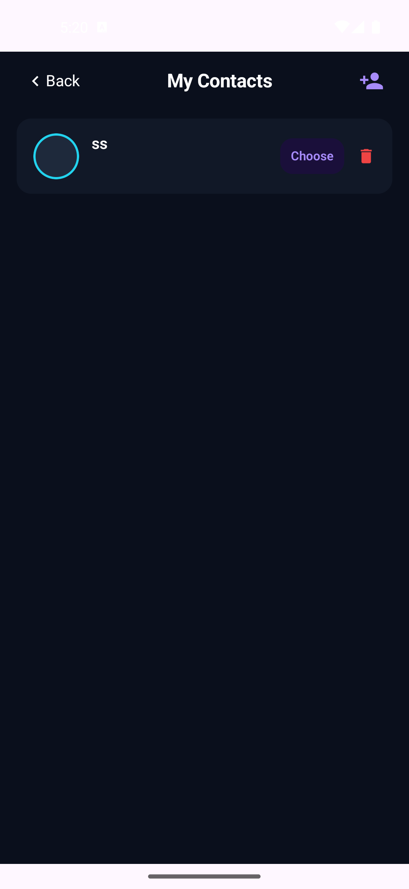
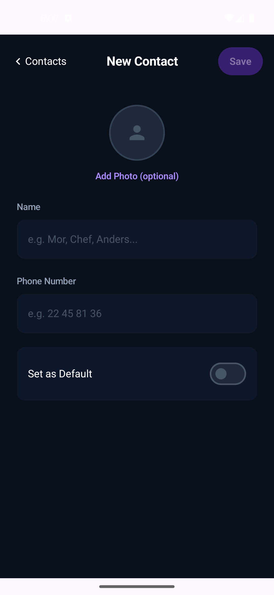

# Escape — Fake Call App

We've all been there — a conversation you can't get out of, a date that isn't going well, a meeting that ran an hour too long. Sometimes the most graceful exit is a phone call that couldn't wait.

**Escape gives you that call, on demand.** Tap once and your phone rings with a convincing incoming call — ringtone, vibration, caller name, the works. Answer it, make your excuse, and walk away. No awkward goodbyes, no explanations needed.

---

## Demo

<video src="demo.mp4" controls width="320"></video>

> If the video doesn't play inline, download [`demo.mp4`](demo.mp4).

---

## Screenshots

| Random Call | Custom Call | Incoming Call | On Call | Call Ended |
|:-----------:|:-----------:|:-------------:|:-------:|:----------:|
|  |  |  |  |  |

| My Contacts | New Contact |
|:-----------:|:-----------:|
|  |  |

---

## How It Works

1. **Open the app** and tap *Call Now* — or schedule a call for later.
2. **Your phone rings** with a realistic incoming call, even on the lock screen.
3. **Answer the call** to start a live timer with Mute and Speaker controls.
4. **End the call** whenever you're ready to walk away.

---

## Features

**One-tap random call** — Instantly generates a convincing caller. Relationship labels like *Mom, Boss, Dentist* appear 60% of the time; full names the other 40%.

**Custom caller** — Set your own name, number, and photo for a fully personalised call.

**Schedule ahead** — Delay the call by anywhere from a few seconds to 8 hours. It fires reliably even when your phone is in sleep mode.

**Lock-screen popup** — The call appears on top of the lock screen, just like a real incoming call.

**My Contacts** — Save your go-to fake callers and set a default for one-tap access.

---

## Tech Stack

Kotlin · Jetpack Compose · Material Design 3 · Hilt · Room · DataStore · AlarmManager · Foreground Service · Coil

---

## Architecture

Clean Architecture with three strict layers — UI → Domain → Data — plus a System layer (Services, Receivers) injected via Hilt.

```
app/
├── ui/         Compose screens + ViewModels
├── domain/     UseCases · Models · Repository interfaces
├── data/       Room · DataStore · Repository implementations
└── system/     FakeCallService · FakeCallReceiver · AlarmHelper · NotificationHelper
```


